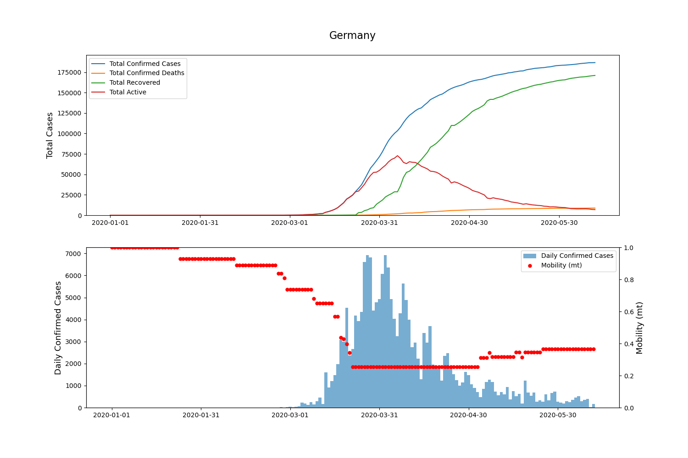

# Covid-19

This library provide data about the location, the number of confirmed COVID-19 cases, deaths and 
recoveries and the mobility of the population for all affected countries. The data is received from 
Johns Hopkins University [1] and Oxford University [2].

## Usage

### Plotting data

```python
from covid.mobility import Mobility

mob = Mobility()
mob.plot_mobility('DEU')
```



### Update data

```python
from covid.mobility import Mobility

mob = Mobility()
mob.update()
```

## Sources

### Johns Hopkins University [1]

The JHU data contains novel coronavirus (Covid-19) confirmed infected, deceased and recovered cases.
The COVID-19 Data Repository by the Center for Systems Science and Engineering (CSSE) at Johns Hopkins University
can be found on [github](https://github.com/CSSEGISandData/COVID-19)

### Oxford University [2]

The Oxford Covid-19 Government Response Tracker (OxCGRT) can be found on [github](https://github.com/OxCGRT/covid-policy-tracker/blob/master/data/OxCGRT_latest_withnotes.csv)

Detailed informations available at [www.bsg.ox.ac.uk](https://www.bsg.ox.ac.uk/research/research-projects/oxford-covid-19-government-response-tracker)

## References:

[1] Dong E, Du H, Gardner L. An interactive web-based dashboard to track COVID-19 in real time. 
Lancet Infect Dis; published online Feb 19. https://doi.org/10.1016/S1473-3099(20)30120-1.

[2] Hale, Thomas and Samuel Webster (2020). Oxford COVID-19 Government Response Tracker.
